### 企业微信 - 群机器人开发- 链家房价

> 引言 ：
>
> 前段时间有同学说想要搞搞附近房价对比，用微信提醒
>
> 在网上找了半天的微信接口，发现都没有用了
>
> 不过企业微信的接口是公开的，微信微信，企业微信也算个微信，开搞！
>
> 群机器人配置说明:  https://developer.work.weixin.qq.com/document/path/91770

### 效果展示

- 群聊机器人

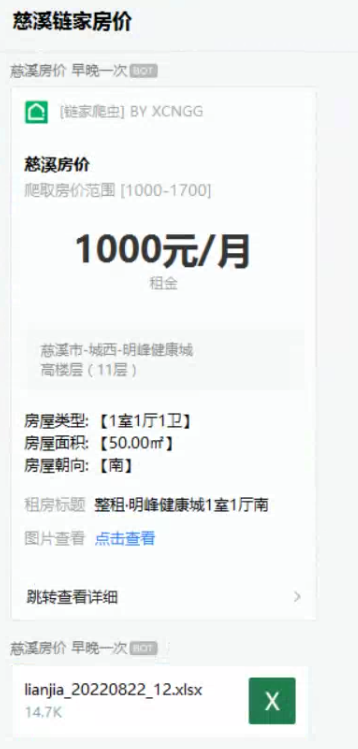

- 附件表格内容

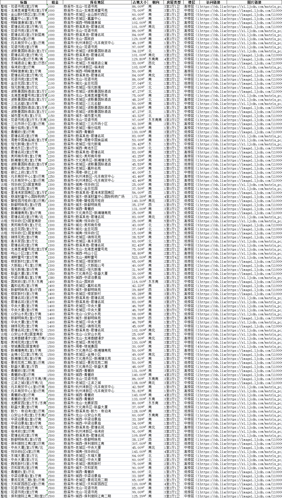

### 网站分析

#### 1. 观察URL变化


根据不断的点击筛选参数，我们可以发现，URL会根据筛选而变化

#### 2. 寻找数据来源

- 按下`Ctrl+U` 查看网页源码
- 按下`Ctrl+F` 搜索关键词

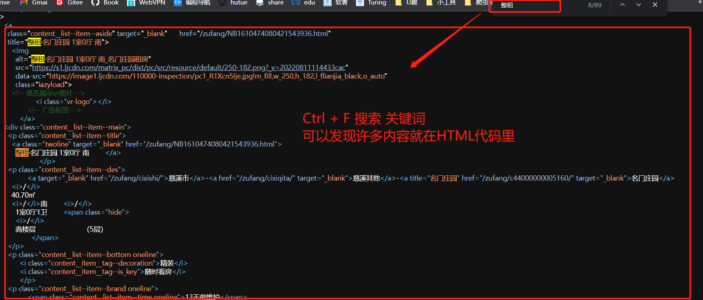

可以发现数据来源于**HTML**文件

那么事情就非常简单了，我们只需要通过修改`Get`这个`URL`来进行翻页，其次根据网页格式解析`HTML`，那么就能实现数据的采集。

### 爬虫代码编写

#### 模块调用

```python
import re
from bs4 import BeautifulSoup
import requests
from fake_useragent import UserAgent
```

#### 爬虫类

```python
class spider:
    # 初始化
    def __init__(self):
        self.headers={
            "User-Agent": UserAgent().random
        }
        self.data_list = []
```

#### 翻页方法

```python
    #传参翻页
    def fetch_https(self,page):
        """
        :param page: 页码
        :return: 当前页数网站的响应状态
        """
        self.headers['Referer'] = 'https://nb.lianjia.com/'
        self.headers['User-Agent'] = UserAgent().random
        url = f'https://nb.lianjia.com/zufang/cixishi/pg{page}rp2/#contentList'
        response = requests.get(url, headers=self.headers)
        return response
```

#### HTML解析器

```python
 # 解析器
    def parser(self,response):
        """
        :param response: 当前页数的响应状态
        :return:  当前页数的数据列表
        """
        soup = BeautifulSoup(response.text, 'lxml')
        item_list =soup.select('div[class="content__list"] div[class="content__list--item"]' )
        data_list = []
        for index,item in enumerate(item_list):
            data ={}
            main = item.select('div[class="content__list--item--main"]')[0]
            #解析标题
            title = main.select('p[class^="content__list--item--title"]')[0].text.replace('\n','').replace('\t','').replace(' ','')
            data['title'] = title
            #解析直达URL
            url = main.select('p[class^="content__list--item--title"] a')[0]['href']
            data['url'] = url
            #解析相关信息列表
            info =main.select('p[class="content__list--item--des"]')[0].text.replace('\n','').replace('\t','').replace(' ','')
            data['info_list'] = info.split('/')
            #解析租金价格
            price = main.select('span em')[0].text.replace('\n','').replace('\t','').replace(' ','')
            data['price'] = price
            #解析图片地址
            img_src = item.select('a[class^="content__list--item--aside"] img')[0]['data-src']
            data['img_src'] = img_src
            data_list.append(data)
        return data_list
```

#### 跑动入口

```python
def run(self,page):
    """
    :param page: 页码
    """
    response = self.fetch_https(page)
    self.data_list +=self.parser(response)   
```

#### 初步效果演示

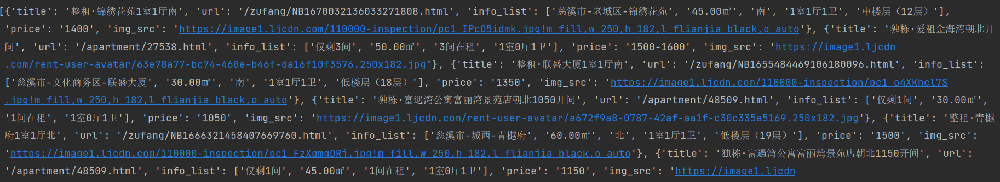

> 以上代码完成了指定页数，即可返回数据列表

#### 确定最大页数

新的问题来了，既然要翻页，那么我们就要知道网页的最大页数，那么如何确定最大页数呢？

我们可以使用正则表达式来提取最大页数

```python
# 提取最大页数
def get_max_page(self):
    url = "https://nb.lianjia.com/zufang/cixishi/rp2/"
    response = requests.get(url, headers=self.headers)
    if response.status_code == 200:
        result = re.findall('<div class="content__pg" data-el="page_navigation".*data-totalPage=(.*) data-curPage=1>',response.text)
        return int(result[0])
```

如此，我们便能通过for循环遍历访问每个页数的房价，得到各个页数的数据了。

----

我们查看下数据列表中的数据有多少条

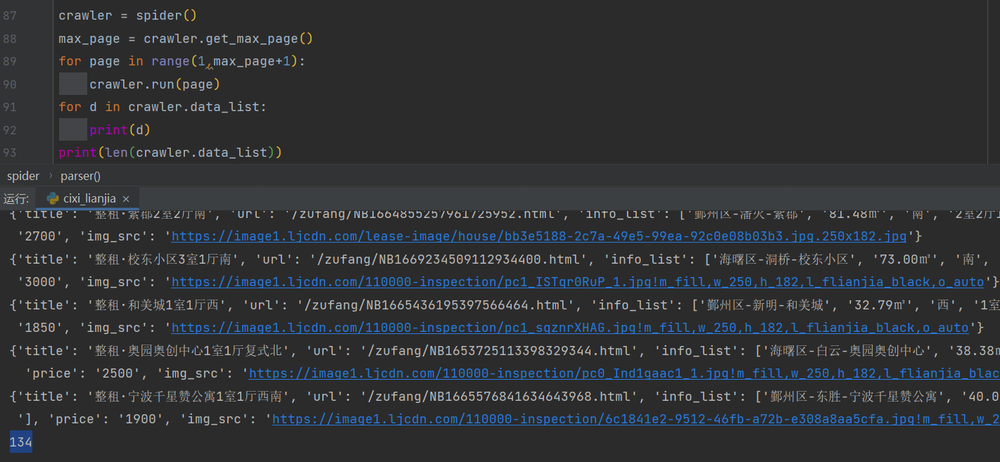

可以看到，是`134`条


那多出来的`8`条是哪里来的呢？仔细观察发现，最后一页的`猜你喜欢`也被我们爬取下来了

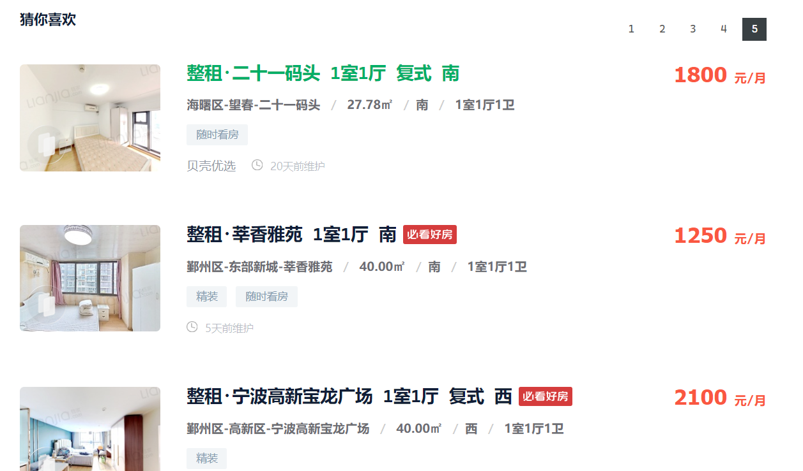

这些数据我们可以切片删除，也可以保留。

---

### 数据存储代码编写

有了数据列表，我们就可以存储为`Excel`表格，为什么要存储为`Excel`表格呢？

企业微信机器人的发送接口一分钟内能调用的次数有限`（每个机器人发送的消息不能超过20条/分钟。）`

我们可以发送部分数据，其次把所有数据保存为`Excel`，再继续做发送，以便用户能看全我们的数据

```python
import pandas as pd
import time
def save_excel(dic_data):
    """
    :param dic_data: 数据列表 
    :return:  保存的文件名称
    """
    # 将字典列表转换为DataFrame
    pf = pd.DataFrame(list(dic_data))
    # 指定生成的Excel表格名称
    file_name = 'lianjia_' + time.strftime("%Y%m%d_%H", time.localtime())
    file_path = pd.ExcelWriter(f'./data/{file_name}.xlsx')
    # 替换空单元格
    pf.fillna(' ', inplace=True)
    # 输出
    pf.to_excel(file_path, encoding='utf-8', index=False)
    # 保存表格
    file_path.save()
    return file_name
```

> 以上代码完成了根据数据列表进行保存`Excel`

### 企业微信开发

在发送消息前，我们需要添加一个群聊机器人

这里测试了一下，**`只有群聊成员都是企业成员才能添加群聊机器人，非企业成员+企业成员俺也不晓得怎么添加`**

#### 添加群聊机器人

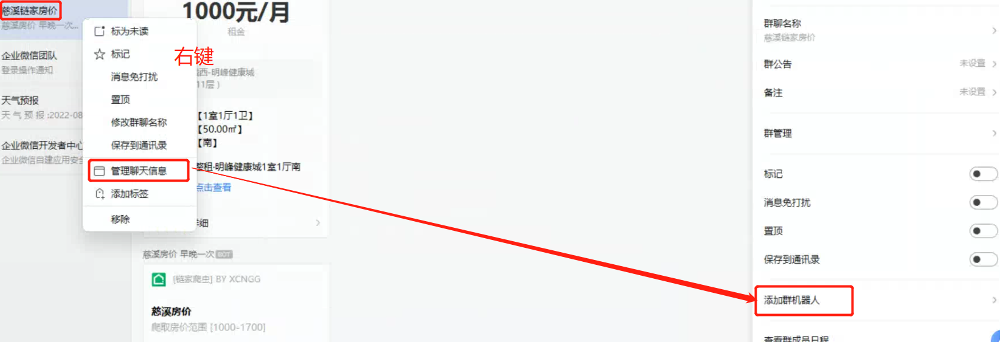

#### 确认群聊机器人的`webhook`

右键机器人，可以查询它的资料

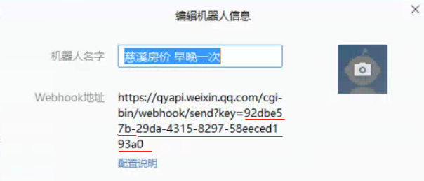

本次案例中用到的群聊机器人，使用的`key`和`webhook`地址如上所示

#### 文本消息发送

> 有了`webhook`地址，我们可以初步尝试下微信的消息发送。

官方说明文档链接

https://developer.work.weixin.qq.com/document/path/91770#%E5%A6%82%E4%BD%95%E4%BD%BF%E7%94%A8%E7%BE%A4%E6%9C%BA%E5%99%A8%E4%BA%BA

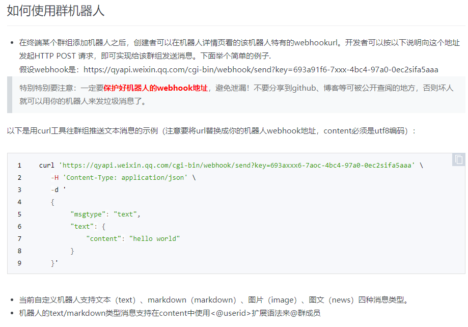

- Python 代码编写

```python
# 初步 message
def start():
    data = {
        "msgtype": "text",
        "text": {
            "content": "链家慈溪爬虫 展示低价前18房价\n"
                    f"开始时间戳 【{time.time()}】"
        }
    }
    url = "https://qyapi.weixin.qq.com/cgi-bin/webhook/send?key=92dbe57b-29da-4315-8297-58eeced193a0"
    headers = {'Content-type': 'application/text'}
    r = requests.post(url=url,headers=headers,json=data)
    print(r.text)
```

---

- 效果如下

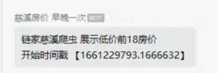

#### 图文链接消息发送

搞定了文本消息的发送，感觉不好看怎么办呢？

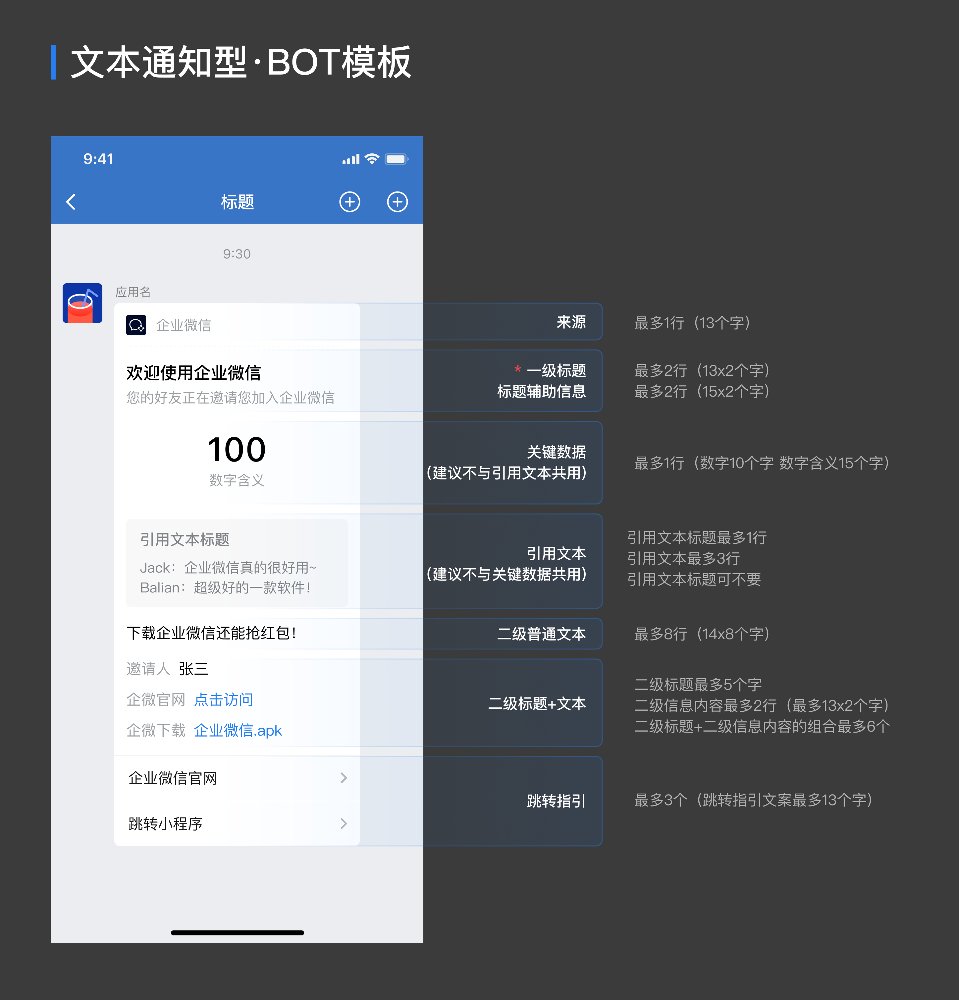

企业微信提供了相关的模板以及相关的代码，我们只需要套壳修改就好：

https://developer.work.weixin.qq.com/document/path/91770#%E5%9B%BE%E6%96%87%E5%B1%95%E7%A4%BA%E6%A8%A1%E7%89%88%E5%8D%A1%E7%89%87

```python
{
    "msgtype":"template_card",
    "template_card":{
        "card_type":"text_notice",
        "source":{
            "icon_url":"https://wework.qpic.cn/wwpic/252813_jOfDHtcISzuodLa_1629280209/0",
            "desc":"企业微信",
            "desc_color":0
        },
        "main_title":{
            "title":"欢迎使用企业微信",
            "desc":"您的好友正在邀请您加入企业微信"
        },
        "emphasis_content":{
            "title":"100",
            "desc":"数据含义"
        },
        "quote_area":{
            "type":1,
            "url":"https://work.weixin.qq.com/?from=openApi",
            "appid":"APPID",
            "pagepath":"PAGEPATH",
            "title":"引用文本标题",
            "quote_text":"Jack：企业微信真的很好用~\nBalian：超级好的一款软件！"
        },
        "sub_title_text":"下载企业微信还能抢红包！",
        "horizontal_content_list":[
            {
                "keyname":"邀请人",
                "value":"张三"
            },
            {
                "keyname":"企微官网",
                "value":"点击访问",
                "type":1,
                "url":"https://work.weixin.qq.com/?from=openApi"
            },
            {
                "keyname":"企微下载",
                "value":"企业微信.apk",
                "type":2,
                "media_id":"MEDIAID"
            }
        ],
        "jump_list":[
            {
                "type":1,
                "url":"https://work.weixin.qq.com/?from=openApi",
                "title":"企业微信官网"
            },
            {
                "type":2,
                "appid":"APPID",
                "pagepath":"PAGEPATH",
                "title":"跳转小程序"
            }
        ],
        "card_action":{
            "type":1,
            "url":"https://work.weixin.qq.com/?from=openApi",
            "appid":"APPID",
            "pagepath":"PAGEPATH"
        }
    }
}
```

----

我们对其进行了修改，并传入了我们的爬虫数据，得到的效果是这样的

代码如下


```python
 data = {
            "msgtype": "template_card",
            "template_card": {
                "card_type": "text_notice",
                "source": {
                    "icon_url": "https://nb.lianjia.com/favicon.ico",
                    "desc": "[链家爬虫] BY XCNGG",
                    "desc_color": 0
                },
                "main_title": {
                    "title": "慈溪房价",
                    "desc": "爬取房价范围 [1000-1700]",
                },
                "emphasis_content": {
                    "title": f"{d['price']}元/月",
                    "desc": "租金",
                },
                "quote_area": {
                    "type": 1,
                    "url":  "https://nb.lianjia.com" + d['url'],
                    "appid": "APPID",
                    "pagepath": "PAGEPATH",
                    "quote_text": f"{d['info_list'][0]}\n"
                                  f"{d['info_list'][4]}"
                },
                "sub_title_text": f"房屋类型: 【{d['info_list'][3]}】\n"
                                  f"房屋面积: 【{d['info_list'][1]}】\n"
                                  f"房屋朝向: 【{d['info_list'][2]}】\n",
                "horizontal_content_list": [
                    {
                        "keyname": "租房标题",
                        "value": d['title']
                    },
                    {
                        "keyname": "图片查看",
                        "value": "点击查看",
                        "type": 1,
                        "url": d['img_src'],
                    },
                ],
                "jump_list": [
                    {
                        "type": 1,
                        "url": "https://nb.lianjia.com" + d['url'],
                        "title": "跳转查看详细"
                    },
                ],
                "card_action": {
                    "type": 1,
                    "url": "https://nb.lianjia.com" + d['url'],
                    "appid": "APPID",
                    "pagepath": "PAGEPATH"
                }
            }
        }
```

#### 附件发送

完成了模板的渲染，我们还需要发送生成的`Execl`文件

这需要我们仔细阅读上传文件的说明

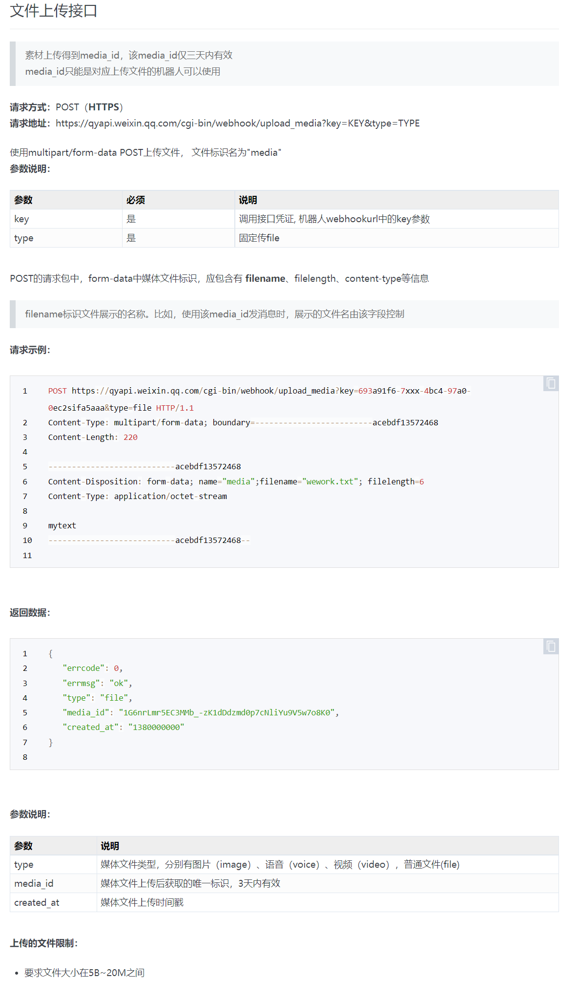

观察文件，发现，我们需要POST请求，得到相关的`media_id`，再配置`media_id`才能发送附件

- 参考代码

```python
import os
from copy import copy
from urllib3 import encode_multipart_formdata

# file_path: e.g /root/data/test_file.xlsx
# 如果D:\\windows\\ 下面file_name的split需要调整一下

# upload_file 是为了生成 media_id， 供消息使用
def upload_file(file_path, wx_upload_url):
    file_name = file_path.split("/")[-1]
    with open(file_path, 'rb') as f:
        length = os.path.getsize(file_path)
        data = f.read()
    headers = {"Content-Type": "application/octet-stream"}
    params = {
        "filename": file_name,
        "filelength": length,
    }
    file_data = copy(params)
    file_data['file'] = (file_path.split('/')[-1:][0], data)
    encode_data = encode_multipart_formdata(file_data)
    file_data = encode_data[0]
    headers['Content-Type'] = encode_data[1]
    r = requests.post(wx_upload_url, data=file_data, headers=headers)
    media_id = r.json()['media_id']
    return media_id

# 发送附件
def sendfile(path,key):
    wx_api_key = key  # 这个地方写机器人的key
    wx_upload_url = "https://qyapi.weixin.qq.com/cgi-bin/webhook/upload_media?key={}&type=file".format(wx_api_key)
    wx_url = 'https://qyapi.weixin.qq.com/cgi-bin/webhook/send?key={}'.format(wx_api_key)
    # # upload_file 是为了生成 media_id， 供消息使用
    media_id = upload_file(path, wx_upload_url)
    # 设置请求头
    headers = {"Content-Type": "text/plain"}
    data = {
        "msgtype": "file",
        "file": {
            "media_id": media_id
        }
    }
    # 发送文件
    requests.post(
        url=wx_url,headers=headers, json=data)
    print("文件发送成功!")
```

### 完整代码

- cixi_lianjia.py

  ```python
  # encoding:utf-8
  # !/usr/bin/python3
  # @AUTHOR : XcNgg
  
  import re
  from bs4 import BeautifulSoup
  import requests
  from fake_useragent import UserAgent
  
  # 爬虫类
  class spider:
      # 初始化
      def __init__(self):
          self.headers={
              "User-Agent": UserAgent().random
          }
          self.data_list = []
  
      #传参翻页
      def fetch_https(self,page):
          """
          :param page: 页码
          :return: 当前页数网站的响应状态
          """
          self.headers['Referer'] = 'https://nb.lianjia.com/'
          self.headers['User-Agent'] = UserAgent().random
          url = f'https://nb.lianjia.com/zufang/cixishi/pg{page}rp2/#contentList'
          response = requests.get(url, headers=self.headers)
          return response
      # 解析器
      def parser(self,response):
          """
          :param response: 当前页数的响应状态
          :return:  当前页数的数据列表
          """
          soup = BeautifulSoup(response.text, 'lxml')
          item_list =soup.select('div[class="content__list"] div[class="content__list--item"]' )
          data_list = []
          for index,item in enumerate(item_list):
              data ={}
              main = item.select('div[class="content__list--item--main"]')[0]
              #解析标题
              title = main.select('p[class^="content__list--item--title"]')[0].text.replace('\n','').replace('\t','').replace(' ','')
              data['title'] = title
              #解析直达URL
              url = main.select('p[class^="content__list--item--title"] a')[0]['href']
              data['url'] = url
              #解析相关信息列表
              info =main.select('p[class="content__list--item--des"]')[0].text.replace('\n','').replace('\t','').replace(' ','')
              data['info_list'] = info.split('/')
              #解析租金价格
              price = main.select('span em')[0].text.replace('\n','').replace('\t','').replace(' ','')
              data['price'] = price
              # print(price)
              #解析图片地址
              img_src = item.select('a[class^="content__list--item--aside"] img')[0]['data-src']
              data['img_src'] = img_src
              # print(data)
              data_list.append(data)
          return data_list
  
      # 跑动入口
      def run(self,page):
          """
          :param page: 页码
          :return: None
          """
          response = self.fetch_https(page)
          self.data_list +=self.parser(response)
  
      # 得到最大页数
      def get_max_page(self):
          url = "https://nb.lianjia.com/zufang/cixishi/rp2/"
          response = requests.get(url, headers=self.headers)
          if response.status_code == 200:
              result = re.findall('<div class="content__pg" data-el="page_navigation".*data-totalPage=(.*) data-curPage=1>',response.text)
              return int(result[0])
  ```

- gen_excel.py

  ```python
  # encoding:utf-8
  # !/usr/bin/python3
  # @AUTHOR : XcNgg
  
  import pandas as pd
  import time
  def save_excel(dic_data):
      """
      :param dic_data: 数据列表
      :return:  保存的文件名称
      """
      print(dic_data)
      # 将字典列表转换为DataFrame
      pf = pd.DataFrame(list(dic_data))
      # 指定生成的Excel表格名称
      file_name = 'lianjia_' + time.strftime("%Y%m%d_%H", time.localtime())
      file_path = pd.ExcelWriter(f'./data/{file_name}.xlsx')
      # file_csv_path = pd.read_csv("compound.csv")
      # 替换空单元格
      pf.fillna(' ', inplace=True)
      # 输出
      pf.to_excel(file_path, encoding='utf-8', index=False)
      # pf.to_csv(file_csv_path, encoding='utf-8', index=False)
      # 保存表格
      file_path.save()
      return file_name
  ```

- message.py

  需要修改自己的`webhook`地址

  ```python
  # encoding:utf-8
  # !/usr/bin/python3
  # @AUTHOR : XcNgg
  
  import requests
  import time
  # 初步 message
  def start():
      data = {
          "msgtype": "text",
          "text": {
              "content": "链家慈溪爬虫 展示低价前18房价\n"
                      f"开始时间戳 【{time.time()}】"
          }
      }
      # todo 自己机器人的webhook地址
      url = ""
      headers = {'Content-type': 'application/text'}
      r = requests.post(url=url,headers=headers,json=data)
      print(r.text)
  
  from copy import copy
  from urllib3 import encode_multipart_formdata
  # file_path: e.g /root/data/test_file.xlsx
  # 如果D:\\windows\\ 下面file_name的split需要调整一下
  # upload_file 是为了生成 media_id， 供消息使用
  def upload_file(file_path, wx_upload_url):
      file_name = file_path.split("/")[-1]
      with open(file_path, 'rb') as f:
          length = os.path.getsize(file_path)
          data = f.read()
      headers = {"Content-Type": "application/octet-stream"}
      params = {
          "filename": file_name,
          "filelength": length,
      }
      file_data = copy(params)
      file_data['file'] = (file_path.split('/')[-1:][0], data)
      encode_data = encode_multipart_formdata(file_data)
      file_data = encode_data[0]
      headers['Content-Type'] = encode_data[1]
      r = requests.post(wx_upload_url, data=file_data, headers=headers)
      media_id = r.json()['media_id']
      return media_id
  
  def sendfile(path,key):
      wx_api_key = key  # 这个地方写你自己的key
      wx_upload_url = "https://qyapi.weixin.qq.com/cgi-bin/webhook/upload_media?key={}&type=file".format(wx_api_key)
      wx_url = 'https://qyapi.weixin.qq.com/cgi-bin/webhook/send?key={}'.format(wx_api_key)
      # # upload_file 是为了生成 media_id， 供消息使用
      media_id = upload_file(path, wx_upload_url)
      #
      headers = {"Content-Type": "text/plain"}
      data = {
          "msgtype": "file",
          "file": {
              "media_id": media_id
          }
      }
      # 发送文件
      requests.post(
          url=wx_url,headers=headers, json=data)
      print("文件发送成功!")
  ```

- robots.py

  需要修改自己的`webhook`地址 以及` key`

  ```python
  from cixi_lianjia import spider
  from concurrent.futures import ThreadPoolExecutor
  import datetime
  import gen_excel
  from message import *
  """
  {'title': '整租·剑兰苑1室1厅南', 
  'url': '/zufang/NB1621831088567484416.html', 
  'info_list': ['慈溪市-老城区-剑兰苑', 
  '58.00㎡',
  '南',
  '1室1厅1卫', 
  '高楼层（6层）'], 
  'price': '1500', 
  'img_src': 'https://image1.ljcdn.com/110000-inspection/pc1_xmjYZ1Kex.jpg!m_fill,w_250,h_182,l_flianjia_black,o_auto'}
  """
  
  # 多线程爬取
  lianjia= spider()
  max_page = lianjia.get_max_page()
  with ThreadPoolExecutor(10) as f:
      for page in range(1,max_page+1):
          f.submit(lianjia.run, page)
  
  # 发送 开始提示
  start()
  # 生成excel
  excel_data =[]
  # 如果当前目录下没有data 这个文件夹则自动创建
  if not os.path.exists('./data'):
      os.mkdir('./data')
  #对数据中文编排
  for data in lianjia.data_list:
      if len(data['info_list'])==5:
          d = {}
          d['标题'] =data['title']
          d['租金'] = data['price']
          d['所在地区'] = data['info_list'][0]
          d['占地大小'] =data['info_list'][1]
          d['朝向'] = data['info_list'][2]
          d['房屋类型'] = data['info_list'][3]
          d['楼层'] = data['info_list'][4]
          d['访问链接'] ="https://nb.lianjia.com"+ data['url']
          d['图片链接'] = data['img_src']
          excel_data.append(d)
  # 对数据根据租金进行排序
  excel_data.sort(key=lambda x: int(x['租金']))
  # 生成Excel文件 并存储
  filename = gen_excel.save_excel(excel_data)
  print(f'{filename}文件生成成功')
  
  
  
  
  
  # 对数据进行清洗
  temp = []
  for da in lianjia.data_list:
      # 如果有范围的价格则直接取最高范围
      if '-' in da['price']:
          da['price'] = da['price'].split('-')[1]
      # 如果价格低于1700 则加入列表
      if int(da['price']) <= 1700:
          temp.append(da)
  # 使列表重新赋值
  lianjia.data_list = temp
  
  # 根据价格升序
  lianjia.data_list.sort(key=lambda x: int(x['price']))
  # 只截取前18
  lianjia.data_list = lianjia.data_list[:18]
  #
  for index, d in enumerate(lianjia.data_list):
      # 如果信息列表为5
      # 则按照企业微信腾讯官方给出的模板格式
      if len(d['info_list'])==5:
          data = {
              "msgtype": "template_card",
              "template_card": {
                  "card_type": "text_notice",
                  "source": {
                      "icon_url": "https://nb.lianjia.com/favicon.ico",
                      "desc": "[链家爬虫] BY XCNGG",
                      "desc_color": 0
                  },
                  "main_title": {
                      "title": "慈溪房价",
                      "desc": "爬取房价范围 [1000-1700]",
                  },
                  "emphasis_content": {
                      "title": f"{d['price']}元/月",
                      "desc": "租金",
                  },
                  "quote_area": {
                      "type": 1,
                      "url":  "https://nb.lianjia.com" + d['url'],
                      "appid": "APPID",
                      "pagepath": "PAGEPATH",
                      "quote_text": f"{d['info_list'][0]}\n"
                                    f"{d['info_list'][4]}"
                  },
                  "sub_title_text": f"房屋类型: 【{d['info_list'][3]}】\n"
                                    f"房屋面积: 【{d['info_list'][1]}】\n"
                                    f"房屋朝向: 【{d['info_list'][2]}】\n",
                  "horizontal_content_list": [
                      {
                          "keyname": "租房标题",
                          "value": d['title']
                      },
                      {
                          "keyname": "图片查看",
                          "value": "点击查看",
                          "type": 1,
                          "url": d['img_src'],
                      },
                  ],
                  "jump_list": [
                      {
                          "type": 1,
                          "url": "https://nb.lianjia.com" + d['url'],
                          "title": "跳转查看详细"
                      },
                  ],
                  "card_action": {
                      "type": 1,
                      "url": "https://nb.lianjia.com" + d['url'],
                      "appid": "APPID",
                      "pagepath": "PAGEPATH"
                  }
              }
          }
          # 对应的接口展示模板
          #todo 机器人的webhook地址
          url = ""  
          headers = {'Content-type': 'application/json'}
          result = requests.post(url, headers=headers, json=data)
          print(datetime.datetime.now().strftime('%Y-%m-%d %H:%M:%S') , "文本发送情况提示", result.text)
  
  # todo 写自己的key
  sendfile(path=f'./data/{filename}.xlsx',key='7cbc0433-1633-4e4f-8870-2a92972a38ac')
  
  ```

  